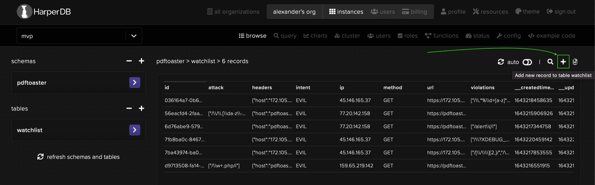
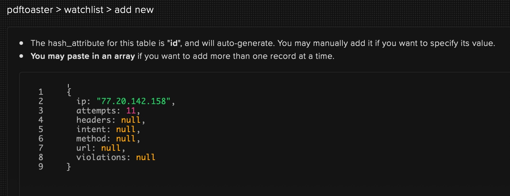

> **One word of warning:** I use this module for many of my personal projects and I therefore may introduce breaking changes in future updates. If you plan to use this package in production, you should better fork the Git repo and maintain it a copy yourself!


# Readme

<h2 align="center">What? Why?</h2>

<p align="center">
    I've recently dicovered <a href="https://www.npmjs.com/package/express-blacklist" target="_blank">express-blacklist</a> and <a href="https://www.npmjs.com/package/express-defend" target="_blank">express-defend</a>. I liked both packages. Unfortunately, they were abandoned a long time ago. There were many improvements that I've had on my mind... but most importantly, I wanted to use <a href="https://www.npmjs.com/package/node-harperdb target="_blank">node-harperdb</a> for blacklisting, instead of plain files!
</p>

<p align="center">
    <a href="https://www.npmjs.com/package/express-blacklist" target="_blank"><code>express-blacklist</code></a> + <a href="https://www.npmjs.com/package/express-defend" target="_blank"><code>express-defend</code></a> + <a href="https://www.npmjs.com/package/node-harperdb target="_blank"><code>node-harperdb</code></a> = <b><code>onguard</code></b>
</p>

<p align="center">
    Install this package from NPM: <code>npm i onguard</code><br>
    🤍
</p>


## Setup your defense 🦹‍♂️

The `require("onguard")` statement returns a function which you must call with a `settings` object. The configuration function will then return an express middleware handler, which you plug into your application (router middleware chain).

> There's even more to it... Besides the config-function, the return value actually contains a `defend` method, an `attacks` Map and `Pattern` class. [But let's put it aside for now and expore it later in depth...](#suspicious-requests)

The easiest way to get started, is to use it as a middleware function. Plug 'onguard' straight into your `express` app instance or your `express.Router` like so:

```js
app.use(require("onguard")({ // `app` is your express application or an express.Router
    harperdb: {
        instance: "https://my-app.harperdb.io...",
        auth: "b64Ba$ic4ut#Htoken=",
        schema: "my_app", // default is "onguard"
        table: "violent_requests" // default is "malicious"
    }
}))
```

`harperdb.schema` (alias a HarperDB namespace) defaults to `"onguard"` and the `harperdb.table` settings parameter defaults to `"watchlist"`. Both setting parameters are therefore optional!

> See [node-harperdb](https://www.npmjs.com/package/node-harperdb) for more information about the `harperdb: {}` config object (which is identical to this the constructor in the `HarperDB` class).

**The above example is everything you need to use 'onguard' in your project!✌️** - But you can customize the settings even further, if you want. You can also extend the preset rules for validating reqests and detecting malicious attacks. This is done by literal path strings or regex expressions. We will explore this topic later.

You can also assign the configuration function from the `require` call to a variable and create your defense middleware later, if you prefer to do that.

```js
const defend = require("onguard")

// ... do whatever ...

app.use(defend({
    // Value of 1 will block client ip immediately upon first suspicious request!
    // Default value is 10
    attempts: 3,
    
    // Adds a new ExpressJS Request decorator with custom name.
    // For example: request.evil = {name, patterns}
    decorator: "evil", // default decorator name is "violation"

    // An instanceof HarperDB of an object with HarperDB credentials (mandatory)
    harperdb: {
        instance: "...",
        auth: "..."
    }
}))
```

**If you have configured a HarperDB connection already** and want to use *that* connection object, then you can simply pass its handle it directly to the `harperdb` property!

```js
const {database} = require("node-harperdb")
const db = database(
    "https://my-blog.harperdb.io...",
    "auth-key...",
    "my-blog",
    "posts"
)

// ... do something with the "blog" table ...

const defend = require("onguard")

/*
    IMPORTANT:
    Verify (and change if needed) the table your current HarperDB connection instance!
    Do not risk poluting this table with entries from this package!
*/
db.table = "blacklisted-requests" // change the table name of current db connection

app.use(defend({ // setup onguard and use it with current db connection
    attempts: 5,
    status: 403,
    harperdb: db
}))
```

> **But, be careful with that!** It will use the *currently connected database table, and will polute it* with entries of blacklisted client requests!

<h3 id="attempts-count">Choose a reasonable number for the <code>attempts</code> count!</h3>

The default value is `10`. Keeping it at a low value, allows you to blacklist suspicious requests faster, but a low value could be too restrictive for some applications!

Keep in mind, that not every client should be blacklisted immideately for making malicious requests to your application, because the client could have picked-up a bad link somewhere on the internet by accident. Or, he could be a victim to a 'man-in-the-middle' attack himself. (Attacking request was made through this client, by an attacker that uses this client's machine to make bad requests to your app on his behalf.)

If you are not sure, just go with the default (10) and see if it works for you or if it blacklists clients foo fast. If it does, increase the count. (7 worked for me personally pretty good.)


### Settings that you can customize:

Here's is a demo settings object for your defense with all of the parameters and their default values.

```js
{
    harperdb: {
        instance: undefined,
        auth: undefined,
        schema: "onguard",
        table: "watchlist"
    },
    attempts: 10,
    status: 403,
    decorator: "violation"
}
```


## 🤨 How it all works...

Make sure to call your 'onguard' defense middleware *as early as possible* in your application middleware chain!

When you now run your ExpressJS application, then each client request will flow through the 'onguard' middleware. 'onguard' will check the requesting client and the requested URL.

- If it *doesn't* find anything "suspicious" about the request, then the request is passed onto the `next()` handler of your middleware chain. (As if 'onguard' wasn't there.)
- [If 'onguard' detects that the client is trying to attack or abuse your application](#suspicious-requests) by calling malicious URLs on your app, then it will mark this request as "evil"!

> A request may also be classified as *not* "evil" but it could still come from an IP that has become conspicuous in the past (or is even already blacklisted for exceeding the maximal `attempts` that you've set in your config settings).<br>
> (Clients that make malicious requests will be observed over time. [Their IP becomes blacklisted only after they exeed the quota limit](#attempts-count) of `attempts`, that you have defined during your configuration.)<br>
> Anyways, blacklisted clients and evil requests will both be rejected by the 'onguard' middleware! Everything else is permitted to pass.

For "suspicious" requests, 'onguard' will provide a special express request decorator (whose name you can change by setting the `decorator` parameter in your config). For example:

```js
// somewhere AFTER the 'onguard' middleware...
app.use(function(request, response, next) {
    console.log(request.violation)
    // returns:
    /*{
        intent: "EVIL",
        name: "ReflectedXSS",
        patterns: [
            "/node_modules"
        ]
    }*/
})
```

**An evil request *should* be rejected immideatelly!** - But 'onguard' doesn't just decide to drop the request! *Instead,* it sets the `response.statusCode` to `403 Forbidden` and passes the request to your `next("Response rejected!")` error handler! - **You decide how to respond** to the client! - **This behaviour gives you maximal control over the response!** (And this is also the most 'vanilla' way of handling exceptions in ExpressJS! No callback-hell anymore.)

You could create an error handler just after the 'onguard' middleware function, to specifically catch and handle "evil" client requests, rejected by 'onguard'... But you could also let the error hit your default `404 Not Found` error handler, if you want. - (You already know, that everyone should have a final error handler in their middleware chain, right? It is the one last function, that catches all the errors in your app and responds with a sane message to the client. [If you don't, then please, do yourself a favor and read this!](http://expressjs.com/en/guide/error-handling.html#the-default-error-handler))

```js
const {catfile} = require("fopsy") // NPM package
const credentials = catfile("./blacklist.json")[0] // HarperDB connection object stored as JSON file
const defend = require("onguard") // this NPM package
let app = require("express")() // ExpressJS application instance

app.use(defend({
    attempts: 10,
    decorator: "badclient",
    harperdb: JSON.parse(credentials.content)
}))

app.use(function(error, request, response, next) { // onguard blacklist handler!!!
    //response.status(404) // default status is 403. Want to change it?
    //response.send(error) // detailed error message from onguard (Probably not a good idea to present the blacklisted client with it!)

    // instead, you could console.log this detailed error message
    // or you could use a dedicated file logger of your choice to log this event...
    console.log(error)

    // or you can build your own log message...
    // here are a couple useful variales that you could use:

    const intent = request.badrequest === undefined ? "good" : "bad"
    console.info(`Rejected request had generally a ${intent} intent...`)

    if(request.badrequest !== undefined) {
        console.log("Detected attack:", request.badrequest.name)
        console.log("Attack was detected by patterns:", request.badrequest.name)
        console.log("Request method:", request.method)
        console.log("Request url:", request.originalUrl)
    }

    console.log("Suspicious client IP:", request.ip)

    // respond to the client with the default 403 status code and a customized message
    response.send("Dear visitor, your request is malformed!")
    
    // You could also call `next(error)` or `next("custom error message")`
    // and let this middleware fall-through directly into your default error handler!
})

app.get("/", function(request, response, next) {
    response.send("Welcome, visitor!")
})

app.use(function(error, request, response, next) { // your default error handler
    response.status(404).send(error)
    next()
})

app.listen()
```

One little reminder: You are dealing with express middleware here. Do not forget to respond or call `next` within your middlware handler functions. Otherwise your app will freeze when a request hits such a handler that is not releasing the request.

To sum it up: Good requests go through normally. Bad requests throw an error and will end up in one of your error handlers. Well, that's about it!


<h2 id="blacklist-client">Blacklist/Whitelist clients (IP 🍒cherry-picking)</h2>

You've learned how to use 'unguard' in *novice mode*.^^ Now, let's UP the game a little bit more!

In novice mode, 'onguard' will automatically validate all incomming HTTP requests and validate them based on some regex rulesets (we will cover them in the next section). 'onguard' will track any suspicious clients and monitor their requests over time. As soon as a client exceeds the threshold of evil requests that he can make (which you define in settings discussed above), that client will automatically become **blacklisted** and will never again be able to make requests without being rejected by 'onguard'. - Even if his subsequent requests aren't "evil" anymore! The client is simply **blacklisted** and that's it then.

### Whitelisting

If you want to *whitelist an already blacklisted* client, then you need to remove all of the records about that client inside of your database! This makes 'onguard' forget that client and his history of "evil" habbits.😅

If you want a client to be **whitelisted forever**, then add a new record to [your database](https://studio.harperdb.io). Set the `ip` attribute to the client's IP address and set the `attempts` counter to `"-Infinity"`! (Your are giving that client a limitless *negative* balance of bad attempts, effectively. So, no matter how many good or evil request this client does, he will never exhaust his infinite balance and therefore can never be blacklisted for exeeding the `attempts` threshold that you've defined in your settings.)

### Blacklisting

There are also times when you want to help 'onguard' a little bit. Let's say you have an IP that you frequently see in your logs, which is always passing your 'onguard' defense. But you can certainly tell that this IP belongs to a spammer, bot or an attackers and you want to block that client...

To **blacklist an IP once and forever**, go to your [HarperDB Studio Instance](https://studio.harperdb.io) and create a new record. Set `ip` to the IP address of the client you want to blacklist and set `attampts` counter to an integer that is **larger than the max. `attempts` count that you've configured for your 'onguard' defense middleware!** You can use the same trick as with whitelisting and set it to `"Infinity"`!

Here's an example... 

<p align="center">
    
    
</p>

My settings for 'onguard' were left at default `10` attempts. So, added a new client record with attempts count of `11` and that's it. Now, that client will be considered 'blacklisted'. As a result that client will be rejected forever, even if his request become valid (not evil)! (Blacklisted IP's don't have a chance of passing 'onguard' anymore - until you explicitly whitelist them or erase their history from your database!)


<h2 id="suspicious-requests">Teach 'onguard' some new tricks! 👶</h2>

While requiring the 'onguard' package in your app, you can also have access to `attacks` (a JS Map object) and to `Pattern` (a JS class object)!

Here are examples. (You can use either one. Both ways are valid.)

```js
let {attacks, Pattern, defend} = require("onguard")

app.use(defend({...})) // this would have been how you'd have created the onguard middleware...
```

```js
const onguard = require("onguard")
let {attacks, Pattern} = onguard

app.use(onguard({...})) // this would have been how you'd have created the onguard middleware...
```

Anyways, the `Pattern` class is what allows you to define your own RegExp pattern for 'onguard'.

`attacks` on the other hand, contain already predefined RegExp patterns! Attacks are basically grouped collections of Regex Patterns. 'Onguard' applies these patterns then onto the `request.originalUrl` path and if one of the patterns in `attacks` matches the requested URL, then it is considered to be an "evil" request!

For example: If a client tries to request `/.well-known/secret.txt`, 'ongurd' will reject it, because there are two `Pattern` in `attacks` that match this URL und cause a validation conflict:

```js
/\/\.[\da-z\-_]+$/i
/\.well\-known\/.*\/?[a-z]+\.txt$/i
```

- The first Regex basically forbids asking for Dotfiles on your server.
- The second Regex was specifically made to disallow sniffing inside the Certbot challenge directory which you might use for your SSL certificates at Let's Encrypt.

Um, now you know the backstory, it's time to create your own rules! ("One Pattern to rule them all!" As they say it.)


### Making your own rules! 😏

First of all, let's see what 'onguard' already offers, by printing out the `attacks` Map with `console.log(attacks)`.

You will see that out-of-the-box you will have some protection against `SQLInjection`, `ReflectedXSS` and `PathTraversal`! [(You can also find them here.)](https://github.com/geekhunger/onguard/blob/main/collection.js) This is nice, isn't it?

Now lets append two new rules to the `PathTraversal` collection:

```js
attacks.PathTraversal.add([
    "/foo/bar",
    /\/foobar\/bar|baz$/i
])
```

- With the first rule, requests that contain `/foo/bar` in the request URL will be rejected by 'onguard'.
- The second rule will reject all requests to URL's that end with `/foobar/bar`, `foobar/bar`, `/foobar/baz`, `foobar/baz`. (Note: If there's a search query like `?name=geekhunger&role=admin` then it will be part of the URL and our rule would not match anymore, because we look onto the ending of the URL and query strings always come last on a URL! That's how the web works.)

#### Want to publish your rule within a new collection?

Examples:

```js
attacks.set("NewCollectionName", new Pattern("/literal/rule")
attacks.set("NewCollectionName", new Pattern(/regex\/rule/i)
attacks.set("NewCollectionName", new Pattern([
    // many rules in one go...
]))
```

#### Want to clear the whole collection of rules?

Example: `attacks.SQLInjection.clear()`

#### Want to clear the entire presets and start fresh?

Example: `attacks.clear()`

(All JavaScript methods supported for a `Map`, are valid on the `attack` variable.)


